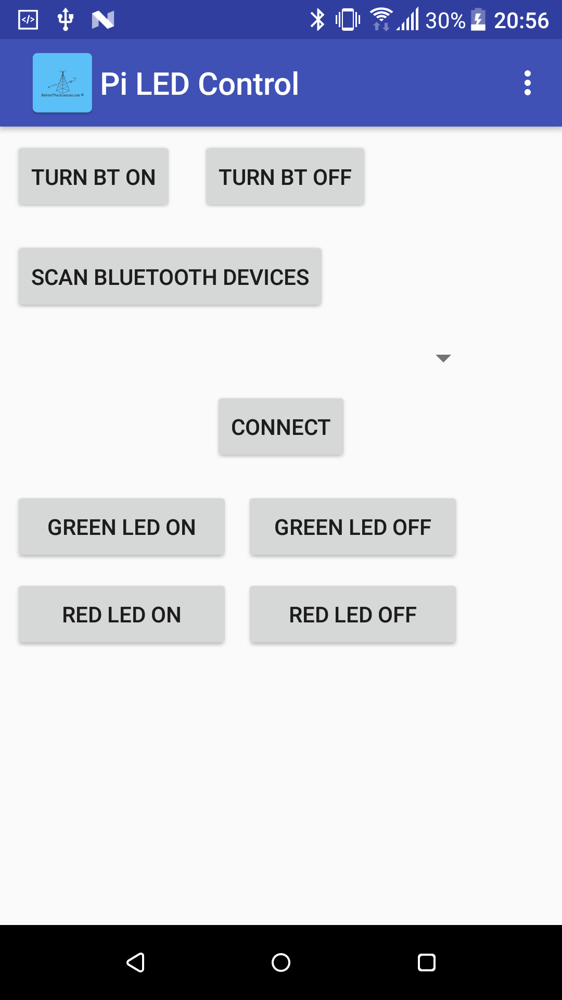

# Raspberry-Pi-Bluetooth-GPIO-Control
### Controlling Raspberry Pi GPIO through Bluetooth

  

### Android app

  

For more info: www.behindthesciences.com

https://behindthesciences.com/electronics/controlling-raspberry-pi-gpios-over-bluetooth-with-an-android-app/
